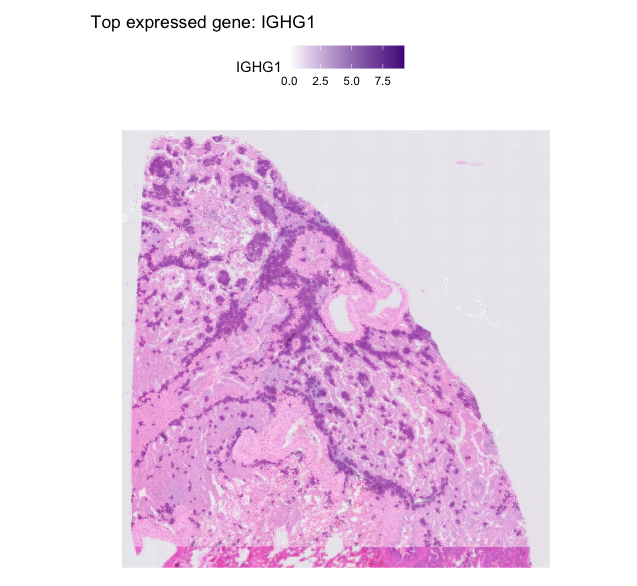

*contact: tyck@vcu.edu*

*File creation: June 04, 2025*  

*Update: * 

**Approximate time: 60 - 120 minutes**

```{r setup, include=FALSE, dev="CairoPNG"}
knitr::opts_chunk$set(echo = TRUE, dev="CairoPNG", out.width = "100%")#, cache=TRUE)
```

# I. Introduction

<!-- Follow this as an example of what I want this to be: https://github.com/yezhengSTAT/CUTTag_tutorial/blob/master/analysis/index.Rmd -->

## 1.1. Overview of Spatial Transcriptomics Data


## 1.2. Objectives

<!-- Max -->

## 1.3. Requiremnts 

<!-- Andrew: discuss all the step for spaceranger installation on a local computer 
Update mouse info to a sample you are working with
-->


```{r, engine = 'bash', eval = FALSE}
##== linux command ==##
...add info here...
```


# II. Data Pre-processing with `spaceranger count`

If only the `molecule_info.h5` file is available, you'll need to run `spaceranger count` to generate the files required for loading Visium HD data into R or Python.

In this example, Visium HD data files were downloaded from the 10x Genomics website. The following files are needed:

```
Visium_HD_Mouse_Brain_Fresh_Frozen_molecule_info.h5
Visium_HD_Mouse_Brain_Fresh_Frozen_probe_set.csv
Visium_HD_Mouse_Brain_Fresh_Frozen_spatial.tar.gz
```

Unpack the spatial image archive using:

```{r, engine = 'bash', eval = FALSE}
##== linux command ==##
tar -xvzf Visium_HD_Mouse_Brain_Fresh_Frozen_spatial.tar.gz
```

This archive contains a CytAssist image file, which is required for reconstructing spatial coordinates and associating spots with the H&E image.

To run `spaceranger count`, you must provide the `--slide` and `--area` parameters using the exact values specified by 10x Genomics for this dataset. These are critical for mapping spatial barcodes correctly and are typically listed in the associated metadata or sample sheet.

For this tutorial, the relevant information is:

```
Slide serial number: H1-7JN9RJG
Area: A-1
Instrument: Visium CytAssist
Probe set: Visium Mouse Transcriptome Probe Set v2.0
Sequencing
```

Run the following command:

```{r, engine = 'bash', eval = FALSE}
##== linux command ==##
spaceranger count \
  --id=Visium_HD_Mouse_Brain_Fresh_Frozen \
  --transcriptome=../refdata-gex-mm10-2020-A \
  --probe-set=Visium_HD_Mouse_Brain_Fresh_Frozen_probe_set.csv \
  --molecule-h5=Visium_HD_Mouse_Brain_Fresh_Frozen_molecule_info.h5 \
  --image=./spatial/cytassist_image.tiff \
  --slide=H1-7JN9RJG \
  --area=A-1
```
⚠️ Make sure to adjust the file paths and reference transcriptome directory as needed for your setup.

# III. Loading and Visualizing 10x Visium HD Binned Data

10x Genomics now provides binned spatial transcriptomics outputs that allow you to skip the spaceranger count step entirely. You can work directly with the binned data available for download from their website.

✅ This tutorial demonstrates how to load the binned data in R using Seurat v5, and visualize gene expression using SpatialFeaturePlot().

## 2.1 Download and Unpack Binned Data

10x Genomics (https://www.10xgenomics.com/datasets/) provides preprocessed binned spatial transcriptomics outputs for Visium HD datasets. These files allow you to skip the spaceranger count step entirely.

```{r, echo=FALSE, out.width='100%', fig.cap="Download **Binned outputs (all bin levels)**"}
knitr::include_graphics("figures/data_source.png")
```


Once you've downloaded and extracted the dataset (e.g., for 8 µm bin resolution), the directory should look like this:

```{r, engine = 'bash', eval = FALSE}
binned_outputs/square_008um/
├── filtered_feature_bc_matrix.h5
├── spatial/
│   ├── tissue_positions.parquet
│   ├── scalefactors_json.json
│   ├── tissue_lowres_image.png
│   ├── aligned_fiducials.jpg
│   ├── aligned_tissue_image.jpg
│   ├── cytassist_image.tiff
│   ├── detected_tissue_image.jpg
│   └── tissue_hires_image.png

```
This directory contains everything needed to load the dataset into Seurat v5 for downstream analysis and visualization.

## 2.2 Load and Normalize the Data in R

```{r, engine = 'bash', eval = FALSE}
library(Seurat)
library(ggplot2)
library(dplyr)

# Load the Visium HD binned data
seurat_obj <- Load10X_Spatial(data.dir = "./binned_outputs/square_008um/")

# Normalize the data to create the 'data' slot used for plotting
seurat_obj <- NormalizeData(seurat_obj)

top_genes <- rowSums(seurat_obj@assays$Spatial@counts) %>%
  sort(decreasing = TRUE) %>%
  head(20)

top_gene <- names(top_genes)[3]  # Change index to explore other genes

SpatialFeaturePlot(
  seurat_obj,
  features = top_gene,
  images = NULL,            # remove the H&E image
  pt.size.factor = 2        # larger spots
) +
  ggtitle(paste("Top expressed gene:", top_gene)) +
  scale_fill_gradient(low = "white", high = "purple4")

```


```{r, echo=FALSE, out.width='100%', fig.cap="**Figure 1. Visualization of Top Expressed Gene.** Example visualization of a highly expressed gene across spatial bins, displayed using **a single-color gradient** ranging from white to a saturated hue. This approach highlights spatial expression patterns while maintaining sensitivity to low-abundance signals."}

```


<!--  [**Figure 1. Visualization of Top Expressed Gene.** Example visualization of a highly expressed gene across spatial bins, displayed using **a single-color gradient** ranging from white to a saturated hue. This approach highlights spatial expression patterns while maintaining sensitivity to low-abundance signals.](figures/fig1_topgene.png). -->

## 2.3. Quality Control

<!-- Francisco: describe the statistics and show some plots for Visium HD -->

```{r, engine = 'bash', eval = FALSE}
SpatialFeaturePlot(seurat_obj, features = "nCount_Spatial") +
  ggtitle("Total UMI counts per bin") +
  scale_fill_gradient(low = "white", high = "purple4")
  
```


# III. Dimensionality Reduction and Clustering


```{r, engine = 'bash', eval = FALSE}
seurat_obj <- FindVariableFeatures(seurat_obj, selection.method = "vst", nfeatures = 2000)
head(VariableFeatures(seurat_obj), 20)
```

# IV. Cell Typing

# V. Advanced: Overlaying with Bacterial Load

<!-- Miranda: -->
<!-- describe the statistics and show some plots for Visium -->
<!-- describe how bacterial spots are identified and visualized -->

# VI. Gene Expression Analysis in Spatial Context


# VII. Additional Tutorials 


# VIII. References


